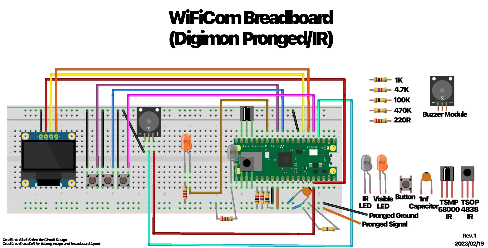

# Breadboard Layout

Note:

* 4K7 in this image is replaced with 6K8 (but if you already bought 4K7, that is fine)
* Bend the IR LED to point in the same direction as the sensors
* Ideally cut the front IR sensor (TSOP4838) to have shorter legs than the back one
* Legendz is not shown here
* GND and Vcc are switched on some screens - check yours carefully - wiring these backwards will destroy the screen instantly!
* Check the pinout of your speaker module too
