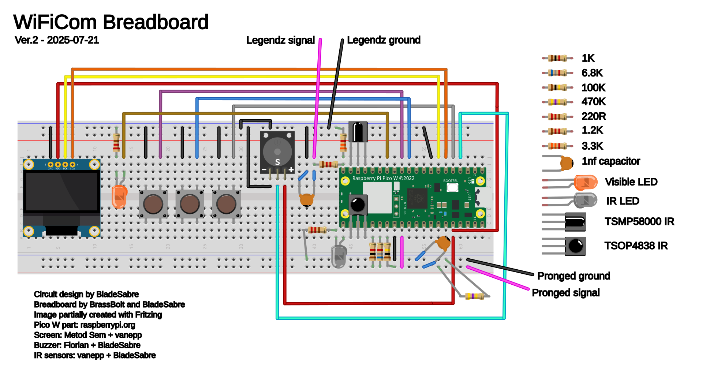

# Breadboard Layout

Note:

* Bend the IR LED to point in the same direction as the sensors
* Ideally cut the front IR sensor (TSOP4838) to have shorter legs than the back one
* GND and Vcc are switched on some screens - check yours carefully - wiring these backwards will destroy the screen instantly!
* Check the pinout of your speaker module too
* The extra jumper on the top power rail is only needed if your breadboard model has gaps in the rails
* If the blue and red rails are the other way around, the important thing is which components are connected to the same one
