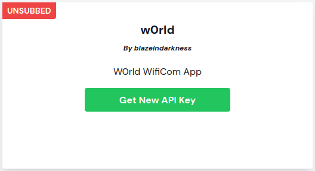
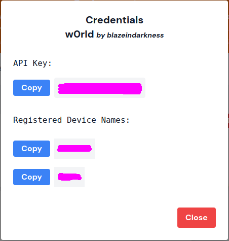
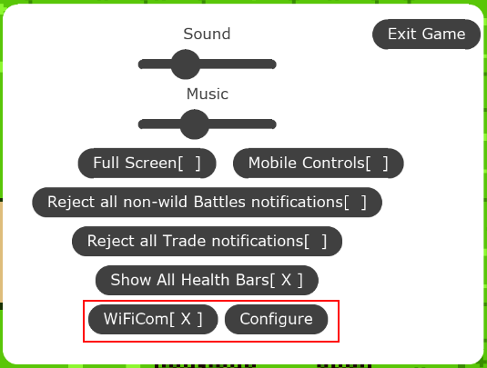

# w0rld Integration

The w0rld development team has now added WiFiCom to the w0rld game.  This works for all supported platforms that the game runs on.

## Obtain Credentials
1. Create an API key: On the [API Keys](https://wificom.dev/app-credentials) page, click "Get New API Key" for w0rld
        
1. Copy your API Key and Device Name from the box which appears
        

## Configure w0rld
1. Open w0rld and login, navigate to the settings menu (Gear icon)
    
1. Click the WiFiCom "Configure" button
1. Enter your WiFiCom API Key when prompted
1. Enter your WiFiCom Device Name when prompted
1. Enable WiFiCom by checking the "WiFiCom" checkbox

## Play w0rld
1. Ensure your WiFiCom is connected to WiFi (first menu option)
1. Go ahead and summon as usual, you only need to press the DCom button once now!
1. You can also battle as usual, at this point your WiFiCom should be working, if not, please check you followed every step
1. If your WiFiCom has a speaker, it will beep to let you know when it has received your requests from w0rld

## Use an A-Com/D-Com
Simply uncheck the WiFiCom box in the settings menu to use an A-Com/D-Com

## Use another WiFiCom
1. Click the WiFiCom "Configure" button again
1. The saved API Key is hidden. If you need to change it, enter a new one when prompted, otherwise continue without editing the text. (You don't need to change this unless you reset it on wificom.dev or you have multiple WiFiCom accounts.)
2. Check/edit the Device Name when prompted.
